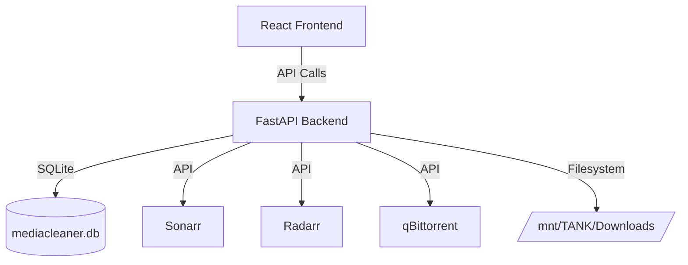

# MediaCleaner 🧹

> Intelligent orphaned release cleaner for Sonarr, Radarr & qBittorrent

MediaCleaner identifies orphaned media releases in your download directories that are no longer tracked by your Arr apps (Sonarr/Radarr) or actively seeding in qBittorrent, helping you easily reclaim storage space.

## Features
- 🚀 **Multi-Stage Docker Image:** Lightweight Python backend + React frontend.
- 📡 **Sonarr & Radarr Integration:** Verifies media files against your actual library databases.
- 🔗 **qBittorrent Support:** Checks if downloads are still seeding (with Hit & Run grace periods).
- 🧹 **Orphan Identification:** Safely identifies files that can be cleaned up.
- 🛠️ **Configurable ZFS/TrueNAS Paths:** Designed natively to work with single volume mounts and dataset hardlinks.

## Architecture



## Prerequisites
- Docker & Docker Compose
- Sonarr / Radarr / qBittorrent configured
- Single volume mount for your media to ensure accurate path matching and hardlinking

## Quick Start

1. **Clone the repository:**
   ```bash
   git clone https://github.com/yourusername/MediaCleaner.git
   cd MediaCleaner
   ```

2. **Configure environment:**
   ```bash
   cp .env.example .env
   # Edit .env with your settings and API keys
   nano .env
   ```

3. **Start the application:**
   ```bash
   docker compose up -d
   ```

4. **Access the UI:**
   Open http://your-server-ip:9876 in your browser.

## Configuration

| Variable | Default | Description |
|----------|---------|-------------|
| `PUID` | `568` | User ID for file ownership (568 matches TrueNAS Apps) |
| `PGID` | `568` | Group ID for file ownership |
| `TZ` | `Europe/Paris` | Timezone |
| `APP_PORT` | `9876` | Port to expose on the host |
| `CONFIG_PATH` | `./config` | Path to store app configuration/DB |
| `DOWNLOADS_HOST_PATH` | `/mnt/TANK/Downloads` | Host path to media/downloads |
| `SONARR_URL` | - | URL to Sonarr |
| `SONARR_API_KEY` | - | Sonarr API Key |
| `RADARR_URL` | - | URL to Radarr |
| `RADARR_API_KEY` | - | Radarr API Key |
| `QBITTORRENT_URL` | - | URL to qBittorrent |
| `QBITTORRENT_USERNAME` | - | qBittorrent WebUI Username |
| `QBITTORRENT_PASSWORD` | - | qBittorrent WebUI Password |
| `HIT_AND_RUN_DAYS` | `7` | Days to keep files if they are still seeding |
| `LOG_LEVEL` | `INFO` | Logging level (DEBUG, INFO, etc.) |

*Note: Internally the app mounts your host downloads path to `/data`. The internal `SONARR_LIBRARY_PATH` and `RADARR_LIBRARY_PATH` environment variables are pre-configured in `docker-compose.yml` to point to `/data/Series_4K` and `/data/Film` respectively based on standard setups.*

## TrueNAS Scale Deployment

MediaCleaner is fully optimized for TrueNAS Scale using custom apps or Docker Compose.

### Dataset Setup
For the best performance and to enable hardlinks, keep your downloads and media libraries on the same dataset. For example:
- **Root Dataset:** `/mnt/TANK/Downloads`
  - **Sonarr Library:** `/mnt/TANK/Downloads/Series_4K`
  - **Radarr Library:** `/mnt/TANK/Downloads/Film`

### Permissions (PUID/PGID)
TrueNAS applications run under the `apps` user by default (UID/GID 568). Ensure your `PUID` and `PGID` in the `.env` file are set to `568` so MediaCleaner can access and manage your media files smoothly.

### Volume Mounting
In your TrueNAS app configuration, mount `/mnt/TANK/Downloads` to `/data` inside the container. This single mount allows the application to resolve paths cleanly.

## GitHub Container Registry
A pre-built image is available via GHCR. You can pull the latest version directly:
```bash
docker pull ghcr.io/yourusername/mediacleaner:latest
```

## Screenshots
*(Add screenshots of the dashboard and orphaned file list here)*

## FAQ
**Q: Does it automatically delete files?**
A: No, MediaCleaner only identifies orphaned releases. It will list them for you to review and safely manage.

## License
MIT License
